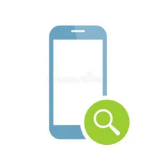
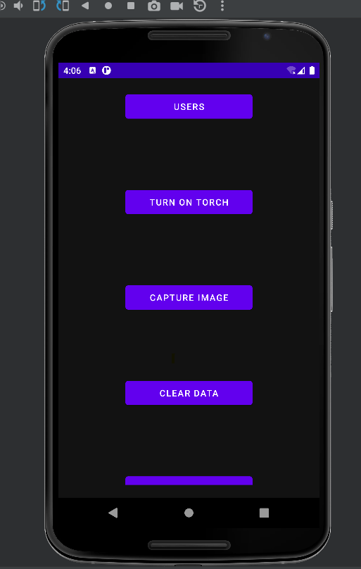

# Phone Police

Phone Police is an Android app that allows users to turn on the flashlight and fetch the location of their mobile devices using GPS location. The app utilizes RecyclerView for displaying a list of functionalities, Lottie library for animations, and Firebase for data storage and retrieval.

## Screenshots

*Home Screen of the app*

*Features of the app *

## Features

- Turn on/off the flashlight: Users can easily toggle the flashlight on their mobile devices with a single tap.
- Fetch GPS location: The app uses GPS location to retrieve the current geographical coordinates of the user's device.

## Technologies Used

- RecyclerView: Used to display a scrollable list of functionalities, providing a smooth user interface for easy navigation.
- Lottie library: Integrated animations to enhance the user experience and provide visual feedback for certain actions.
- Firebase: Used for data storage and retrieval, allowing seamless synchronization of user preferences and settings across devices.

## Installation

1. Clone the repository:https://github.com/uphargaur/Phone-Police.git

2. Open the project in Android Studio.

3. Build and run the app on an Android device or emulator.

## Usage

1. Launch the app on your Android device.

2. Grant necessary permissions for accessing the flashlight and GPS location.

3. Tap the flashlight button to turn it on/off.

4. Tap the "Fetch Location" button to retrieve the GPS coordinates of your device.

## Contributing

Contributions are welcome! If you encounter any issues or have suggestions for improvements, please feel free to open an issue or submit a pull request.

## License

[MIT License](LICENSE)
